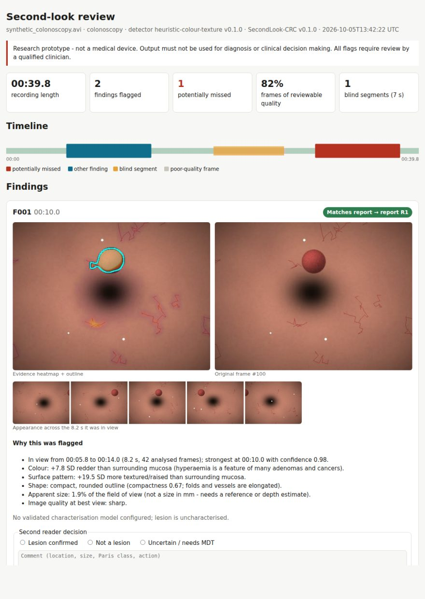
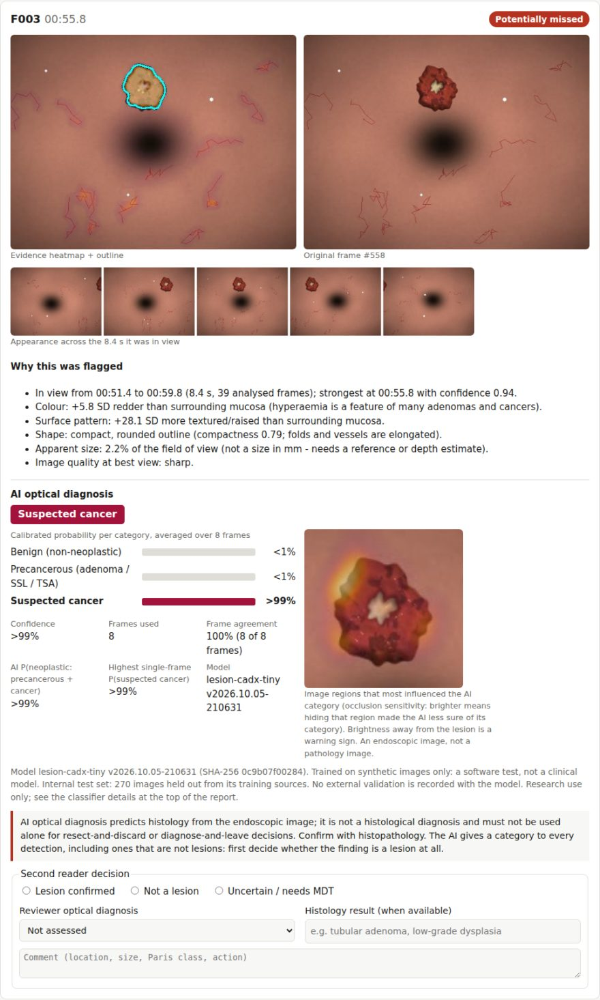

# SecondLook-CRC

**Offline AI second-look review for colonoscopy and capsule endoscopy recordings.**

> ⚠️ Research prototype. Not a medical device. Do not use for diagnosis or clinical decisions.

Upload a recorded colonoscopy video or capsule study. SecondLook then:

* **finds candidate lesions** and groups them over time, so you get one finding per lesion, not hundreds of boxes,
* **compares them with the procedure report** and flags the ones the endoscopist did not document as *potentially missed*,
* **shows blind segments**, the parts of the recording too blurred, dark or glary to review,
* **explains every flag** with an evidence heatmap, the exact lesion outline, a filmstrip of frames and plain-English reasons,
* **predicts each lesion's likely histology category** (benign, precancerous or cancerous) when a trained
  classifier is supplied: probabilities from several frames (labelled calibrated only when they are), an explanation map, and
  "indeterminate" instead of a guess when it is unsure. This is optical diagnosis, not a histological
  diagnosis; histopathology remains the reference standard,
* **captures the second reader's decision** (confirmed / not a lesion / uncertain) and exports it for sign-off, audit and retraining,
* runs **fully on the local machine**, with a tamper-evident audit log.

It handles **traditional colonoscopy** and **capsule endoscopy** through separate modality
profiles. It is designed to become the shared detection "brain" for MADSyncro (simulator)
and MADAlpha (robotic capsule), with VR-Caps (this repository) supplying synthetic training data.



## Quick start

```sh
cd SecondLook-CRC
pip install -e '.[dev]'

# Generate a synthetic recording with two polyps (the "report" only mentions one) and review it
secondlook demo --out demo_output
#   -> demo_output/review/report.html : one finding matches the report, one is flagged "potentially missed"

# Analyse your own recording
secondlook analyse procedure.mp4 --modality colonoscopy --report procedure_report.json
secondlook analyse capsule_frames/ --modality capsule --image-fps 4

# Local browser interface (localhost only)
secondlook serve        # open http://127.0.0.1:8765

# Check the audit log has not been altered
secondlook audit-verify
```

The procedure report is a simple JSON list of the lesions the endoscopist found, by time or
frame. See [examples/procedure_report.json](examples/procedure_report.json). Without it, findings are
listed as "not compared".

## Using a trained model

The default detector is a training-free colour/texture baseline. It exists so the whole
workflow can be shown and tested, and it is **not** accurate on real footage. Train a
segmentation model and pass it in:

```sh
pip install -e '.[train,model]'
python training/train_segmentation.py --data kvasir_seg --epochs 40 \
    --out models/unet.pt --export models/unet.onnx
secondlook analyse procedure.mp4 --model models/unet.onnx
```

Dataset folders use `images/` + `masks/` (Kvasir-SEG layout). VR-Caps synthetic exports can be
used for pre-training. See [docs/DATASETS.md](docs/DATASETS.md).

## Optical diagnosis (benign / precancerous / cancerous)



Endoscopy shows lesions, not cells. Given a trained classifier, SecondLook predicts the histology
category the pathologist is likely to report for each finding:

* **benign:** hyperplastic or inflammatory;
* **precancerous:** adenoma, sessile serrated lesion (SSL) or traditional serrated adenoma (TSA);
* **cancerous:** adenocarcinoma.

It averages probabilities over up to eight frames of the lesion and abstains when confidence or
frame agreement is low, when it would otherwise call a lesion benign that is as likely
neoplastic, or when some frames confidently suggest a higher-risk category. Probabilities are
labelled calibrated only when the trainer's temperature fit succeeded. Each categorised finding
gets an occlusion map showing what the decision depended on, and the report shows the model's
file hash, training data and validation status. A "benign" (non-neoplastic) call does not take a
polyp out of surveillance counting. No validated model ships with SecondLook, and the feature is
off unless you pass `--classifier`.

```sh
pip install -e '.[train,model]'

# Check the chain on synthetic drawings (software test only, not a clinical model)
python training/make_synthetic_lesions.py --out data/synth_lesions --n-per-class 200
python training/train_classifier.py --data data/synth_lesions --out models/cadx-synth \
    --backbone tiny --size 96 --epochs 15
secondlook demo --out demo_cadx --classifier models/cadx-synth/model.onnx   # one lesion of each category
#   the report flags this model as trained on synthetic images only

# Train on histology-labelled data (labels.csv: image,label,patient_id[,mask | x,y,w,h][,split])
python training/train_classifier.py --data data/piccolo --data data/centre_a --out models/lesion_cls \
    --backbone resnet18 --weights weights/resnet18-f37072fd.pth    # or --pretrained when online
#   --modality colonoscopy (default) or capsule: a model is only applied to recordings of its modality

# External validation on a centre the model has never seen (warns on any overlap with its development data)
python training/train_classifier.py --evaluate-only models/lesion_cls/model.onnx \
    --data data/centre_b --out reports/centre_b

# Use it
secondlook analyse procedure.mp4 --report procedure_report.json --classifier models/lesion_cls/model.onnx
secondlook serve --classifier models/lesion_cls/model.onnx
```

Only datasets with per-lesion histology can train this classifier: SUN, PICCOLO and REAL-Colon,
plus partner data. Kvasir-SEG, HyperKvasir and PolypGen help detection only. Cancers are rare
in public data, so the cancer class needs targeted collection. Read
[docs/DIAGNOSIS.md](docs/DIAGNOSIS.md) before training or using a model. It covers what the
categories contain, the data needed, evaluation against clinical benchmarks, safety design,
known failure modes and the regulatory impact.

## Outputs

| File | Use |
|---|---|
| `report.html` | Self-contained clinician report (images embedded, no server needed) with second-reader controls |
| `result.json` | Machine-readable results for research and audit |
| `findings/F001_overlay.png` … | Heatmap+outline, original frame and filmstrip for each finding; `F001_diagnosis.png` is the classifier's explanation map |
| `~/.secondlook/audit.jsonl` | Hash-chained log: user, time, input SHA-256, model version, summary |

## Documentation

* [docs/DESIGN.md](docs/DESIGN.md): purpose, how each product characteristic is met, architecture, roadmap, commercial use
* [docs/DIAGNOSIS.md](docs/DIAGNOSIS.md): optical diagnosis (benign / precancerous / cancerous): claims, data, training, evaluation, safety
* [docs/DATASETS.md](docs/DATASETS.md): open and restricted datasets, licensing, VR-Caps synthetic data, evaluation rules
* [docs/REGULATORY.md](docs/REGULATORY.md): UKCA / CE (MDR) / AI Act plan, standards, NHS Scotland deployment

## Project layout

```
secondlook/
  ingest.py        video / image-folder loading, fingerprinting
  quality.py       per-frame quality, blind segments
  detectors/       baseline heuristic + ONNX segmentation model
  tracking.py      detections -> findings over time
  review.py        compare with the procedure report (missed-finding logic)
  characterise.py  CADx plug-in point (off unless a classifier is given)
  diagnosis/       lesion classifier: categories, shared lesion crop, ONNX inference, metrics
  explain.py       heatmap, outline, filmstrip, written rationale
  report.py        HTML + JSON report
  audit.py         tamper-evident audit log
  server.py        local upload UI
  synthetic.py     demo recordings and labelled synthetic lesions with ground truth
training/          model training and ONNX export (segmentation, lesion classifier, synthetic lesions)
tests/             end-to-end tests on synthetic data
```

Run the tests with `pytest` (about a minute and a half on a CPU, including an end-to-end run that
trains a tiny classifier on synthetic lesions; `pytest -m "not slow"` skips that run).
